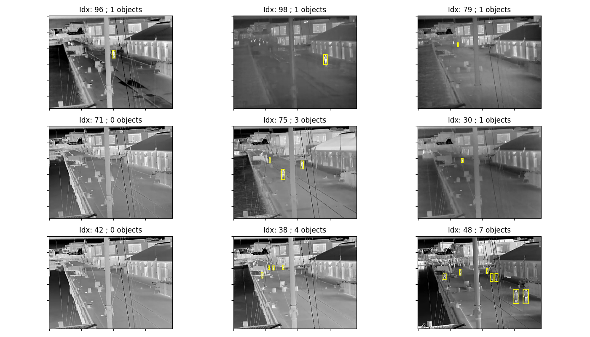
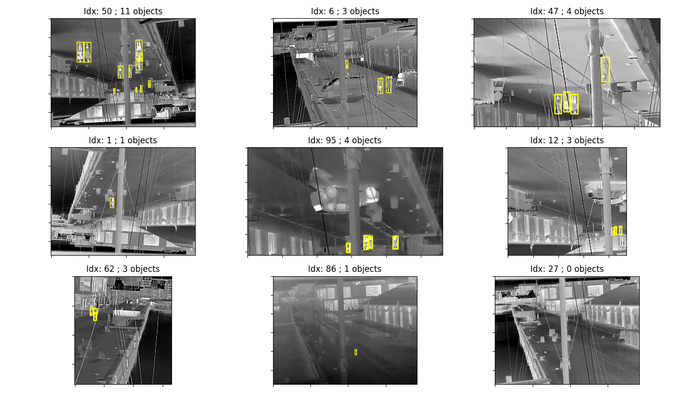
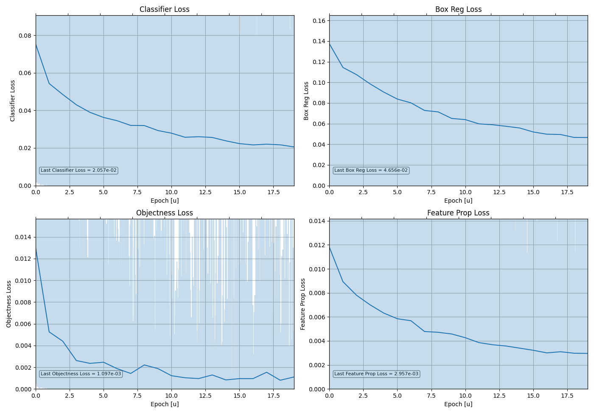
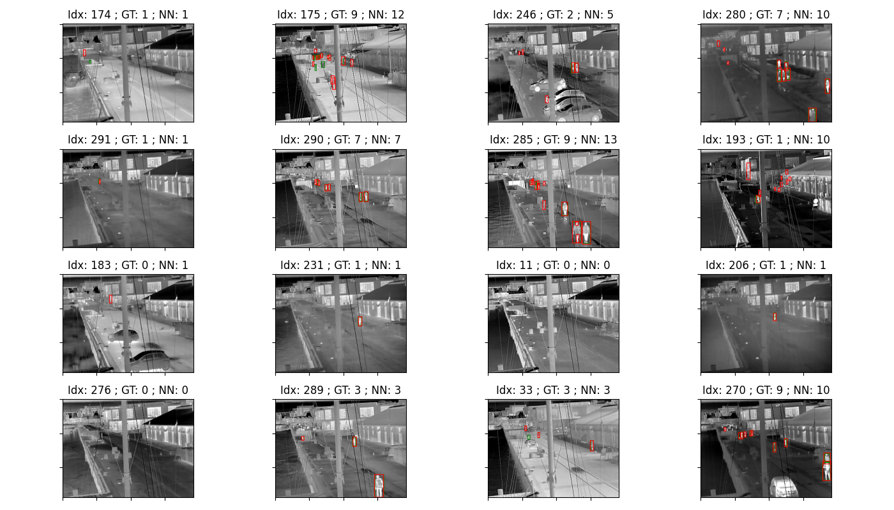

# Thermal Prediction

## Overview

This folder contains source code tackling the Challenge #2 about pedestrian detection.

## Usage Instructions

There are 3 simple entry points to use this part of the repository: 
[`present_dataset.py`](./present_dataset.py), [`train.py`](./train.py) and 
[`test.py`](./test.py).

### Dataset Presentation

To visualize some random images in the dataset, use the 
[`present_dataset.py`](./present_dataset.py) script and pass the data folders you want 
to visualize:

```bash
# Visualize the training set
python present_dataset.py ../dataset/Data_Annotated_Subset_Object_Detectors/training/Feb_Day ../dataset/Data_Annotated_Subset_Object_Detectors/training/Feb_Week/ ../dataset/Data_Annotated_Subset_Object_Detectors/training/Feb_Month/ ../dataset/Data_Annotated_Subset_Object_Detectors/training/Mar_Week/

# Visualize the validation set
python present_dataset.py ../dataset/Data_Annotated_Subset_Object_Detectors/validation

# Visualize the testing set
python present_dataset.py ../dataset/Data_Annotated_Subset_Object_Detectors/testing/Apr_Month ../dataset/Data_Annotated_Subset_Object_Detectors/testing/Aug_Month/ ../dataset/Data_Annotated_Subset_Object_Detectors/testing/Jan_Month/
```

You can also view the augmented version of the dataset by using the `-a` option:

```bash
# Visualize the augmented training set
python present_dataset.py ../dataset/Data_Annotated_Subset_Object_Detectors/training/Feb_Day ../dataset/Data_Annotated_Subset_Object_Detectors/training/Feb_Week/ ../dataset/Data_Annotated_Subset_Object_Detectors/training/Feb_Month/ ../dataset/Data_Annotated_Subset_Object_Detectors/training/Mar_Week/ -a
```

<p float="left">
    
    
</p>

### Training

To train a network, run the [`train.py`](./train.py) script with the appropriate 
arguments and options.

**Help Message**

To display the help message of the sript, run the following command:

```bash
# Display the help message
python train.py --help
```

**Standard Usage**

Train the default network (FasterRcnnResnet50FpnV2) by passing the data folders that you
want to train the network on. 80% of the data will go for training, the other 20% for 
validation:

```bash
# Train the FasterRcnnResnet50FpnV2 model
python train.py ../dataset/Data_Annotated_Subset_Object_Detectors/training/Feb_Day ../dataset/Data_Annotated_Subset_Object_Detectors/training/Feb_Week/ ../dataset/Data_Annotated_Subset_Object_Detectors/training/Feb_Month/ ../dataset/Data_Annotated_Subset_Object_Detectors/training/Mar_Week/
```

**Custom Validation Set**

You can also pass a custom validation set, which is already provided in the 
"Data_Annotated_Subset_Object_Detectors":

```bash
# Train the FasterRcnnResnet50FpnV2 model on the complete training set
python train.py ../dataset/Data_Annotated_Subset_Object_Detectors/training/Feb_Day ../dataset/Data_Annotated_Subset_Object_Detectors/training/Feb_Week/ ../dataset/Data_Annotated_Subset_Object_Detectors/training/Feb_Month/ ../dataset/Data_Annotated_Subset_Object_Detectors/training/Mar_Week/ -v ../dataset/Data_Annotated_Subset_Object_Detectors/validation/
```

**Bath Size and Epochs**

You can tune the number of epochs with the `-e` option, and the batch size with `-b`. We
recommend a small batch size for networks with a ResNet50 backbone (*e.g.* 1 or 2),
unless you have a very large GPU VRAM budget. Here is an example with batch size 2 and
15 epochs:

```bash
# Train the FasterRcnnResnet50FpnV2 model with batch size 2 for 15 epochs
python train.py ../dataset/Data_Annotated_Subset_Object_Detectors/training/Feb_Day ../dataset/Data_Annotated_Subset_Object_Detectors/training/Feb_Week/ ../dataset/Data_Annotated_Subset_Object_Detectors/training/Feb_Month/ ../dataset/Data_Annotated_Subset_Object_Detectors/training/Mar_Week/ -v ../dataset/Data_Annotated_Subset_Object_Detectors/validation/ -b 2 -e 15
```

**Model Choice**

Different models are supported: `FasterRcnnResnet50FpnV2`, 
`FasterRcnnMobileNetV3LargeFpn`, and `FasterRcnnMobileNetV3Large320Fpn`. You can choose
the one you want by using the `-m` option:

```bash
# Train the FasterRcnnMobileNetV3LargeFpn model
python train.py ../dataset/Data_Annotated_Subset_Object_Detectors/training/Feb_Day ../dataset/Data_Annotated_Subset_Object_Detectors/training/Feb_Week/ ../dataset/Data_Annotated_Subset_Object_Detectors/training/Feb_Month/ ../dataset/Data_Annotated_Subset_Object_Detectors/training/Mar_Week/ -v ../dataset/Data_Annotated_Subset_Object_Detectors/validation/ -m FasterRcnnMobileNetV3LargeFpn
```

**Data Augmentation**

By default, data augmentation is off. We recommed enabling it to obtain the best 
performance. To do so, use the `-a` option. This will create a duplicate of the training
set with random photometric distortion, cropping, vertical and horizontal flipping.

```bash
# Train the FasterRcnnResnet50FpnV2 model on both standard and augmented datasets
python train.py ../dataset/Data_Annotated_Subset_Object_Detectors/training/Feb_Day ../dataset/Data_Annotated_Subset_Object_Detectors/training/Feb_Week/ ../dataset/Data_Annotated_Subset_Object_Detectors/training/Feb_Month/ ../dataset/Data_Annotated_Subset_Object_Detectors/training/Mar_Week/ -v ../dataset/Data_Annotated_Subset_Object_Detectors/validation/ -a
```

**Checkpoint loading**

Finally, you can load an existing checkpoint model and keep training on it. To do so,
pass the checkpoint file (must be the same model as you want to re-train) using the `-c`
option. Here is an example where the model will be train for 5 more epochs:


```bash
# Train the FasterRcnnResnet50FpnV2 model for an additional 5 epochs
python train.py ../dataset/Data_Annotated_Subset_Object_Detectors/training/Feb_Day ../dataset/Data_Annotated_Subset_Object_Detectors/training/Feb_Week/ ../dataset/Data_Annotated_Subset_Object_Detectors/training/Feb_Month/ ../dataset/Data_Annotated_Subset_Object_Detectors/training/Mar_Week/ -v ../dataset/Data_Annotated_Subset_Object_Detectors/validation/ -c ./checkpoints/FasterRcnnResnet50FpnV2_epoch-9.pt -e 5
```

### Testing

To test a network, run the [`test.py`](./test.py) script with the appropriate 
arguments and options.

**Help Message**

To display the help message of the sript, run the following command:

```bash
# Display the help message
python test.py --help
```

**Standard Usage**

Test a network by passing the location of the test set, the model name, and the 
checkpoint file:

```bash
# Test a FasterRcnnResnet50FpnV2 model
python test.py ../dataset/Data_Annotated_Subset_Object_Detectors/testing/Apr_Month ../dataset/Data_Annotated_Subset_Object_Detectors/testing/Aug_Month/ ../dataset/Data_Annotated_Subset_Object_Detectors/testing/Jan_Month/ -m FasterRcnnResnet50FpnV2 -c ./checkpoints/FasterRcnnResnet50FpnV2_epoch-9.pt
```

The script will first plot the different losses of the training (stored within the 
checkpoint file). To move on to the testing phase, close the graph (by pressing on "q"
or closing the window). After the testing phase, the mean Average Precision (mAP) 
metrics will be logged in the terminal. Multiple random test images will also be shown,
with the ground truth bouding boxes in green, and the predictions in red.

<p float="left">
    
    
</p>


Here is an example of the mAP metrics produced by the [`test.py`](./test.py) script:
```txt
IoU metric: bbox
 Average Precision  (AP) @[ IoU=0.50:0.95 | area=   all | maxDets=100 ] = 0.352
 Average Precision  (AP) @[ IoU=0.50      | area=   all | maxDets=100 ] = 0.642
 Average Precision  (AP) @[ IoU=0.75      | area=   all | maxDets=100 ] = 0.348
 Average Precision  (AP) @[ IoU=0.50:0.95 | area= small | maxDets=100 ] = 0.337
 Average Precision  (AP) @[ IoU=0.50:0.95 | area=medium | maxDets=100 ] = 0.603
 Average Precision  (AP) @[ IoU=0.50:0.95 | area= large | maxDets=100 ] = -1.000
 Average Recall     (AR) @[ IoU=0.50:0.95 | area=   all | maxDets=  1 ] = 0.108
 Average Recall     (AR) @[ IoU=0.50:0.95 | area=   all | maxDets= 10 ] = 0.378
 Average Recall     (AR) @[ IoU=0.50:0.95 | area=   all | maxDets=100 ] = 0.408
 Average Recall     (AR) @[ IoU=0.50:0.95 | area= small | maxDets=100 ] = 0.396
 Average Recall     (AR) @[ IoU=0.50:0.95 | area=medium | maxDets=100 ] = 0.642
 Average Recall     (AR) @[ IoU=0.50:0.95 | area= large | maxDets=100 ] = -1.000
```
