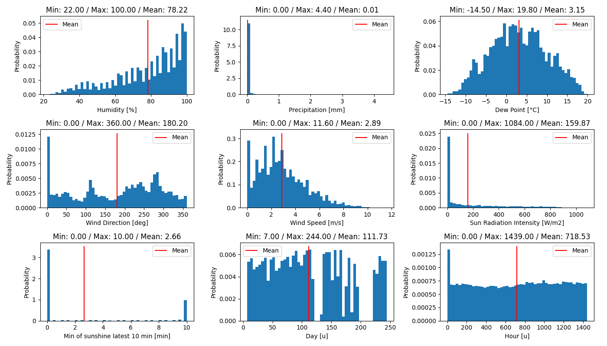
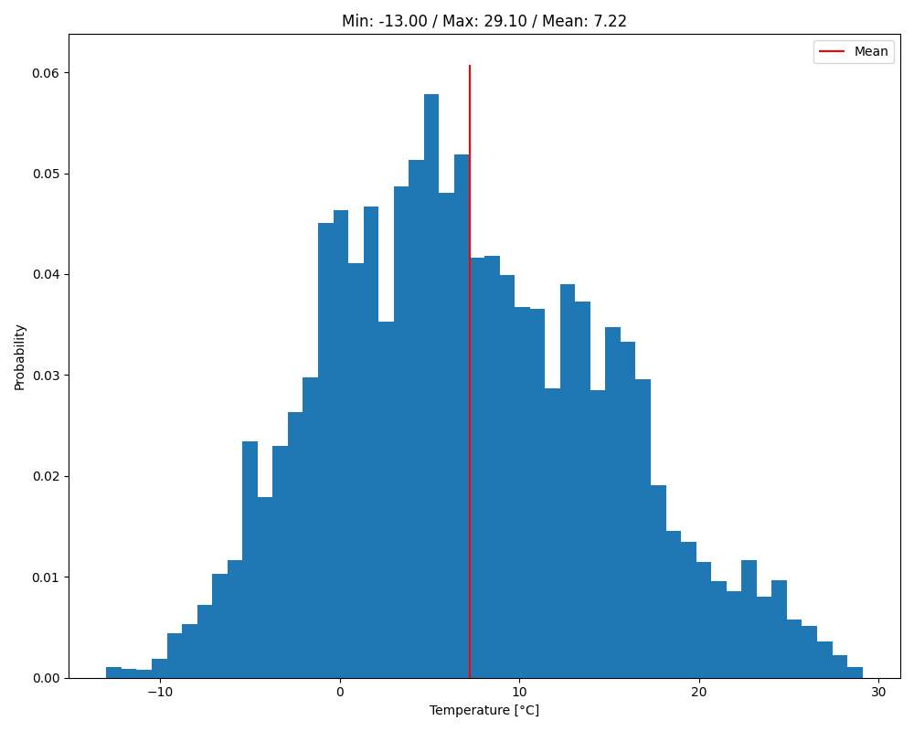
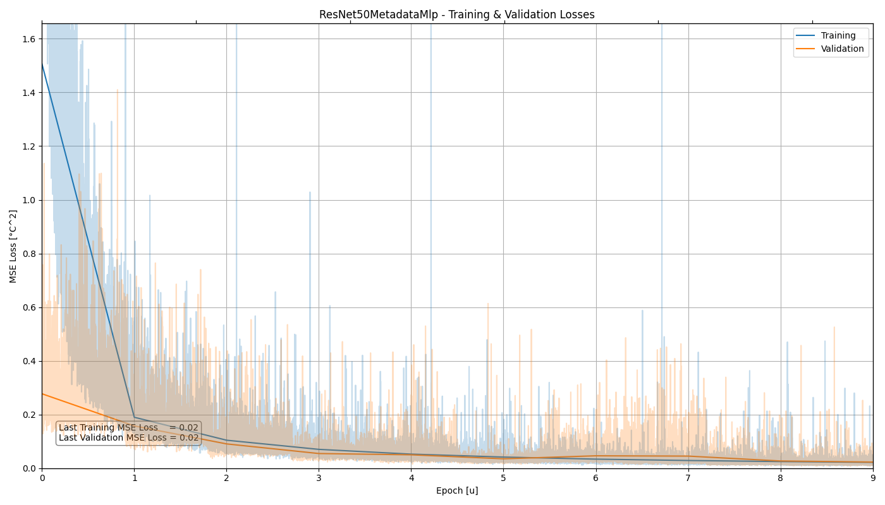

# Thermal Prediction

## Overview

This folder contains source code tackling the Challenge #1 about thermal prediction.

## Usage Instructions

There are 3 simple entry points to use this part of the repository: 
[`present_dataset.py`](./present_dataset.py), [`train.py`](./train.py) and 
[`test.py`](./test.py).


### Dataset Presentation

To visualize the metadata distribution and some random images in the dataset, use the 
[`present_dataset.py`](./present_dataset.py) script and pass the metadata file you want
to visualize, along the root location of the images:

```bash
# Visualize the training set
python present_dataset.py ../dataset/training_testing_split/training_metadata_images.csv ../dataset/LTD_Dataset/LTD_Dataset/Image_Dataset/

# Visualize the testing set
python present_dataset.py ../dataset/training_testing_split/testing_metadata_images.csv ../dataset/LTD_Dataset/LTD_Dataset/Image_Dataset/
```

Some of the images will be randomly flipped horizontally and/or vertically, which is a
random transformation applied to all images.

<p float="left">
    
    
</p>

<p float="left">
    
</p>

### Training

To train a network, run the [`train.py`](./train.py) script with the appropriate 
arguments and options.

**Help Message**

To display the help message of the sript, run the following command:

```bash
# Display the help message
python train.py --help
```

**Standard Usage**

Train the default network (ResNet50) by passing the metadata file that you
want to train the network on and the root location of the images. 80% of the data will
go for training, the other 20% for validation:

```bash
# Train the ResNet50 model
python train.py ../dataset/training_testing_split/training_metadata_images.csv ../dataset/LTD_Dataset/LTD_Dataset/Image_Dataset/
```

**Bath Size and Epochs**

You can tune the number of epochs with the `-e` option, and the batch size with `-b`. We
recommend a small batch size for networks with a ResNet50 backbone (*e.g.* 8 or 16),
unless you have a very large GPU VRAM budget. Here is an example with batch size 16 and
15 epochs:

```bash
# Train the ResNet50 model with batch size 16 for 15 epochs
python train.py ../dataset/training_testing_split/training_metadata_images.csv ../dataset/LTD_Dataset/LTD_Dataset/Image_Dataset/ -b 16 -e 15
```

**Model Choice**

Different models are supported (check [`./models/README.md`](./models/README.md)) for
the complete list and details of each one. You can choose the one you want by using the 
`-m` option:

```bash
# Train the MobileNetV3Small_RgbMetadataMlp model
python train.py ../dataset/training_testing_split/training_metadata_images.csv ../dataset/LTD_Dataset/LTD_Dataset/Image_Dataset/ -m MobileNetV3SmallMetadataMlp
```

**Learning Rate**

You can tune the initial learning rate of the Adam optimizer by using the `-lr` option.
We recomment a small learning rate (*e.g* 1e-4) for pre-trained models (ResNet and 
MobileNet) and a larger one (*e.g.* 1e-3) to train models from scratch (CnnModel, 
MlpModel, MlpModelDateTime, ...).

```bash
# Train the CnnModel model with a learning rate of 1e-3
python train.py ../dataset/training_testing_split/training_metadata_images.csv ../dataset/LTD_Dataset/LTD_Dataset/Image_Dataset/ -m CnnModel -lr 1e-3
```

**Checkpoint loading**

Finally, you can load an existing checkpoint model and keep training on it. To do so,
pass the checkpoint file (must be the same model as you want to re-train) using the `-c`
option. Here is an example where the model will be train for 5 more epochs:


```bash
# Train the ResNet18 model for an additional 5 epochs
python train.py ../dataset/training_testing_split/training_metadata_images.csv ../dataset/LTD_Dataset/LTD_Dataset/Image_Dataset/ -m ResNet18 -c ./checkpoints/ResNet18_fold-0_epoch-9.pt -e 5
```

### Testing

To test a network, run the [`test.py`](./test.py) script with the appropriate 
arguments and options.

**Help Message**

To display the help message of the sript, run the following command:

```bash
# Display the help message
python test.py --help
```

**Standard Usage**

Test a network by passing the location of the metadata test file, the root location of
the images, the model name, and the checkpoint file:

```bash
# Test a ResNet50 model
python train.py ../dataset/training_testing_split/testing_metadata_images.csv ../dataset/LTD_Dataset/LTD_Dataset/Image_Dataset/ ./checkpoints/ResNet50_fold-0_epoch-9.pt -m ResNet50
```

The script will first plot the different losses of the training (stored within the 
checkpoint file). To move on to the testing phase, close the graph (by pressing on "q"
or closing the window). After the testing phase, the Mean-Square Error (MSE) and the 
Mean Absolute Error (MAE) metrics will be logged in the terminal. Multiple random test 
images will also be shown, with the temperature prediction and ground truth above the
images.

<p float="left">
    
</p>

Here is an example of the MSE and MAE metrics produced by the [`test.py`](./test.py) 
script:
```txt
ModelTester: Mean MSE loss 0.02
ModelTester: Mean MAE loss 0.11
```
