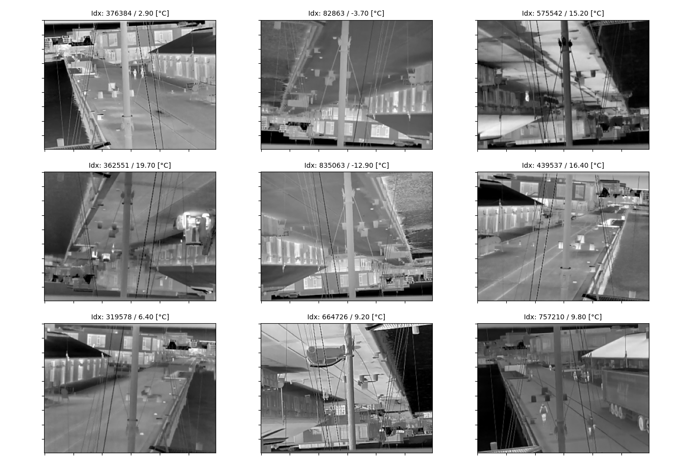

# Thermal Prediction

## Overview

This folder contains source code tackling the Challenge #1 about thermal prediction.

## Usage Instructions

There are 3 simple entry points to use this part of the repository: 
[`present_dataset.py`](./present_dataset.py), [`train.py`](./train.py) and 
[`test.py`](./test.py).


### Dataset Presentation

To visualize the metadata distribution and some random images in the dataset, use the 
[`present_dataset.py`](./present_dataset.py) script and pass the metadata file you want
to visualize, along the root location of the images:

```bash
# Visualize the training set
python present_dataset.py ../dataset/training_testing_split/training_metadata_images.csv ../dataset/LTD_Dataset/LTD_Dataset/Image_Dataset/

# Visualize the testing set
python present_dataset.py ../dataset/training_testing_split/testing_metadata_images.csv ../dataset/LTD_Dataset/LTD_Dataset/Image_Dataset/
```

Some of the images will be randomly flipped horizontally and/or vertically, which is a
random transformation applied to all images.

<p float="left">
    
    
</p>

<p float="left">
    
</p>
